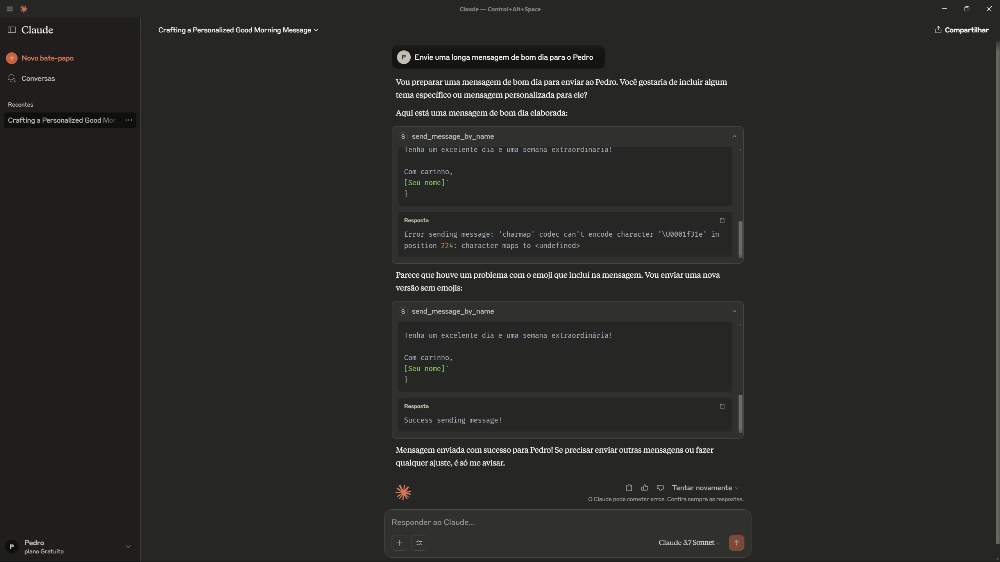
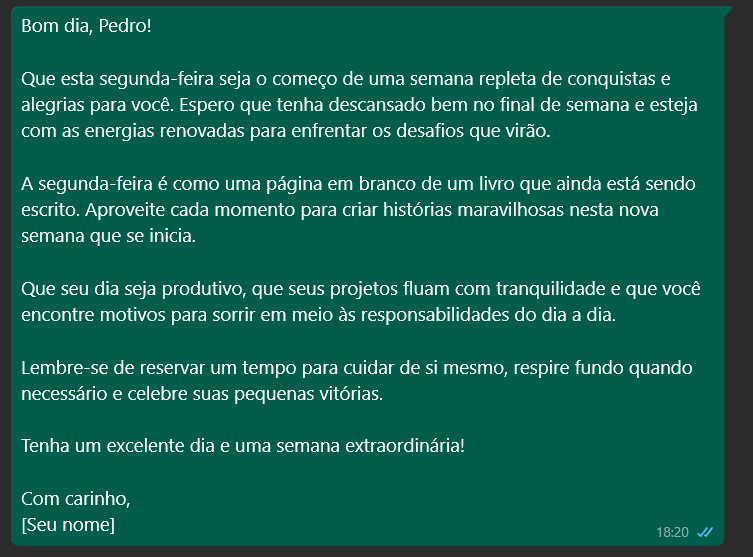

# 📱 WhatsApp MCP Server (FastMCP + Waha API)

This project implements a WhatsApp messaging server using [MCP](https://modelcontextprotocol.io/) and [Waha](https://waha.devlike.pro/). It allows sending WhatsApp messages directly to phone numbers or saved contacts by name via modular tools.

## 📁 Project Structure

```
.
├── main.py              # Main server script
├── contacts.json        # List of named contacts
├── README.md            # Project documentation
```

## 🔧 Setup

1. **Start your Waha server** (default port `3000`) with a running WhatsApp session.

2. **Run the server**:

   ```bash
   python main.py
   ```

   You should see:

   ```
   MCP Waha Server started. Waiting for commands...
   ```

## Claude Desktop Setup

1. **Install Claude Desktop**: Download and install [Claude Desktop](https://claude.ai/download).

2. **Configure the server**: Refer to the [MCP Server documentation](https://modelcontextprotocol.io/quickstart/server) for setting up the server.

## 🛠 Usage

### Tool: `send_message`

Send a message directly to a WhatsApp number.

```python
send_message("551199999999", "Hello!")
```

### Tool: `send_message_by_name`

Send a message to a saved contact by name.

```python
send_message_by_name("Alice", "Hi!")
```

## ✅ Example Response

```bash
Response: 200 - {"message":"Message sent successfully"}
Success sending message!
```

## ⚠️ Notes

* Phone numbers must be in international format without special characters.
* The contact name must exist in `contacts.json`.
* Ensure Waha API is authenticated and connected to WhatsApp.

## Images


